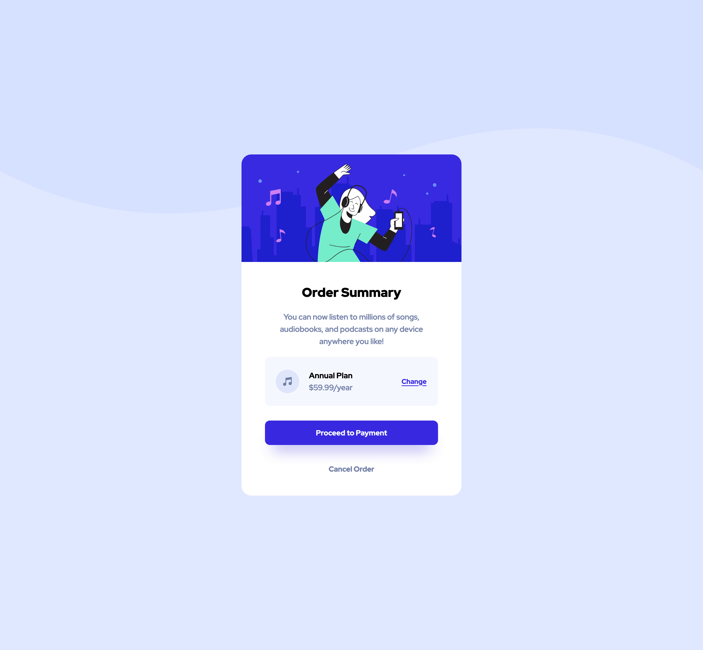

# Frontend Mentor - Order summary card solution

This is a solution to the [Order summary card challenge on Frontend Mentor](https://www.frontendmentor.io/challenges/order-summary-component-QlPmajDUj). Frontend Mentor challenges help you improve your coding skills by building realistic projects. 

## Table of contents

- [Overview](#overview)
  - [The challenge](#the-challenge)
  - [Screenshot](#screenshot)
  - [Links](#links)
- [My process](#my-process)
  - [Built with](#built-with)
  - [What I learned](#what-i-learned)
  - [Useful resources](#useful-resources)
- [Author](#author)

## Overview

### The challenge

Users should be able to:

- See hover states for interactive elements

### Screenshot




### Links

- Solution URL: [https://github.com/hkparkjs/order-summary-component](https://github.com/hkparkjs/order-summary-component)
- Live Site URL: [https://park-order-summary-component.netlify.app/](https://park-order-summary-component.netlify.app/)

## My process

### Built with

- Semantic HTML5 markup
- Flexbox
- Mobile-first workflow

### What I learned
- How to configure image as background
```css
body {
  background-image: url('./images/pattern-background-[mobile/desktop].svg');
  background-size: contain;  /* Scales the image as large as possible
                                within its container without cropping
                                or stretching the image.*/
  background-repeat : no-repeat;
}
```

### Useful resources

- [MDN - background size](https://developer.mozilla.org/en-US/docs/Web/CSS/background-size) - This helped me for setting background size.

## Author

- Frontend Mentor - [@hkparkjs](https://www.frontendmentor.io/profile/hkparkjs)